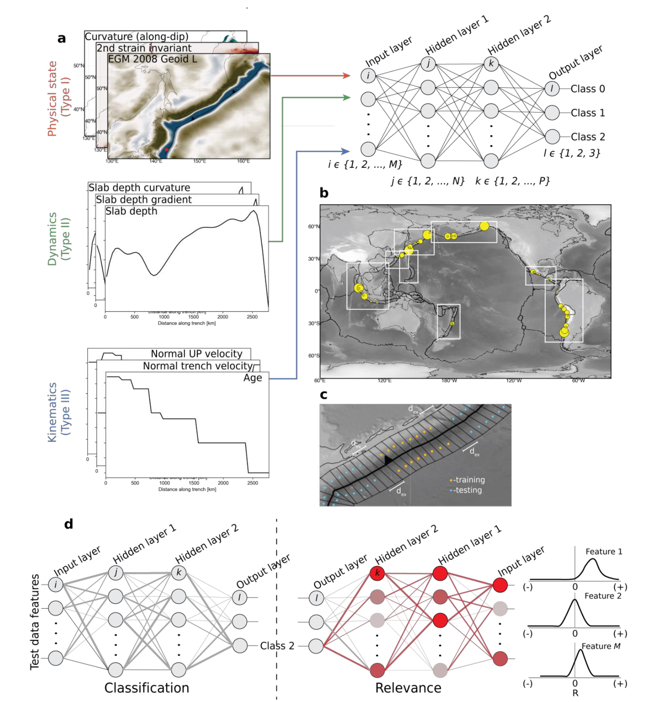
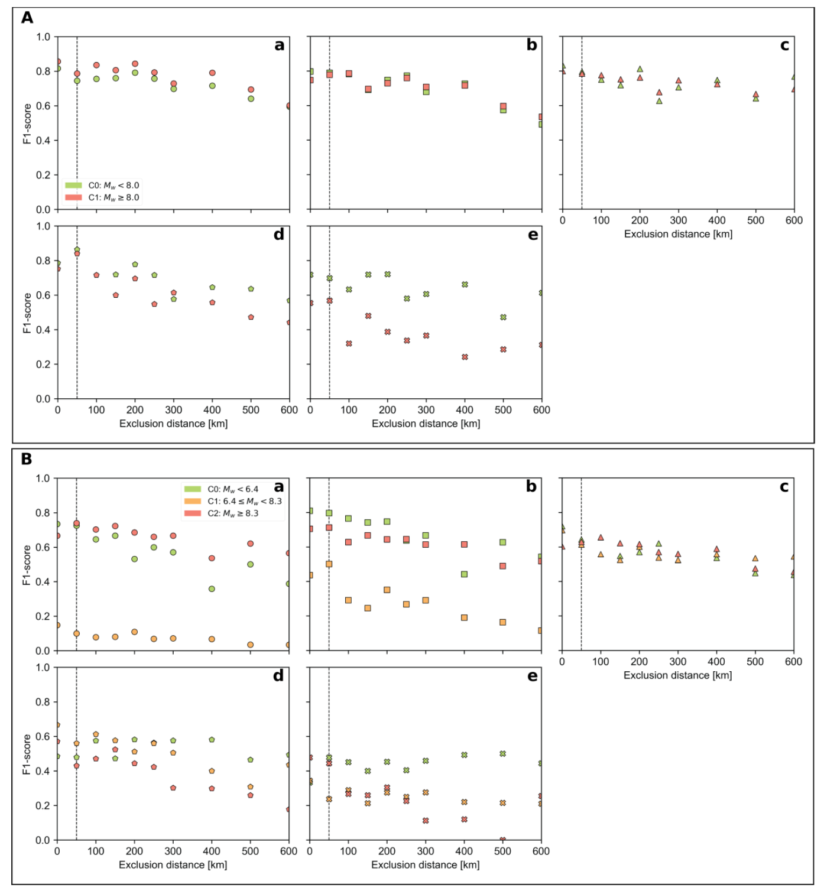

# Novel ML Framework for Classifying Large Earthquake Features Globally

## Project Overview
This project applies machine learning to classify subduction faults based on geophysical and kinematic data. Using a neural network model, the framework integrates physical, dynamic, and kinematic parameters to identify fault behaviours and provide feature-relevance insights. The model is validated on globally distributed datasets and demonstrates high performance in classifying seismic zones, with potential applications in hazard assessment and resource exploration.

## Key Features
- Multi-dimensional Data Integration
- Implements a custom neural network for subduction fault classification.
- Uses Layer-wise Relevance Propagation (LRP) to interpret model predictions and highlight critical features.
- Trained and tested on datasets from worldwide, ensuring scalability and generalization.
- Identifies regions prone to significant seismic activity.
- Guides exploration in tectonically active regions by analyzing subsurface dynamics.
- Improves understanding of tectonic processes critical for engineering and infrastructure planning.

## Peer-reviewed journal articles
This work has recently been accepted into a Tier 1 peer-reviewed journal. The link will be shared once it is online.

----------------------------------

## Model Architecture
The neural network architecture used in this project is illustrated below:

This figure illustrates a neural network-based framework for classifying subduction zones using geophysical and kinematic data. It integrates physical, dynamic, and kinematic parameters (Panel a and b), with systematic training/testing along segments (Panel c). The network classifies subduction behaviours and analyzes feature relevance (Panel d), enhancing insights into hazard assessment and resource exploration.

---

## Performance Evaluation
The model's performance was evaluated using F1-scores across varying exclusion distances:

This figure evaluates the F1-score performance of a classification model for earthquake magnitude categories across varying exclusion distances. Panel A compares two classes (Mw < 8.0) and (Mw ≥ 8.0), while Panel B evaluates three classes (Mw < 6.4), (6.4 ≤ Mw < 8.3), (Mw ≥ 8.3). The plots (a-e) depict trends in model accuracy with increasing exclusion distances, highlighting the model's robustness and sensitivity to data partitioning.

----------------------

## How to use the repo

**helper_pkg**: serves as a foundation for Machine Learning (ML) workflows by enabling efficient data preparation, feature engineering, and spatial sampling.

**ml4szeq**: folder provides a complete end-to-end machine learning pipeline, including data preprocessing, model development, training, evaluation, and prediction for earthquake analysis using PyTorch.

**model**: The folder contains saved PyTorch model checkpoints, enabling model reuse, scenario-based performance evaluation, and inference without retraining.

**ntbk**: The folder contains Jupyter notebooks that implement key project steps, including grid-based spatial sampling, model evaluation, and visualization of Layerwise Relevance Propagation (LRP) heatmaps for interpretability.
